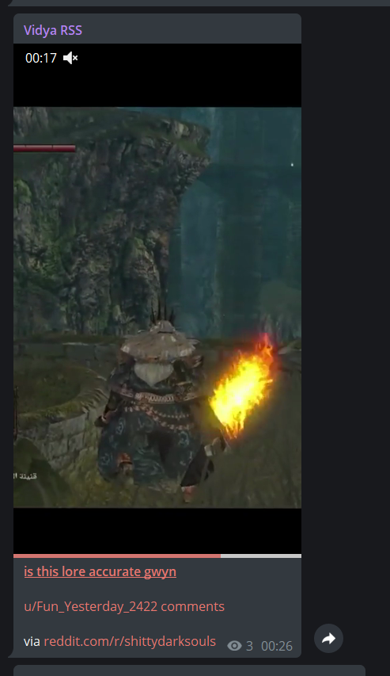
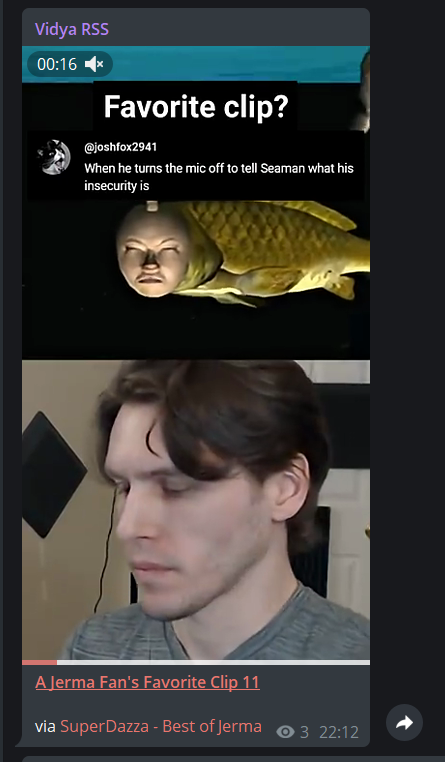
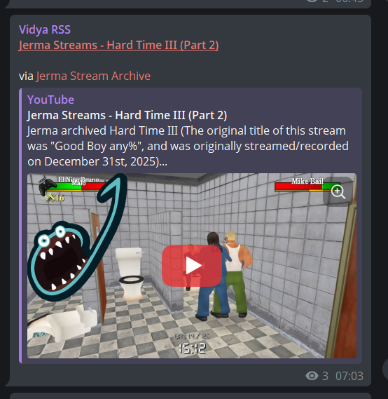
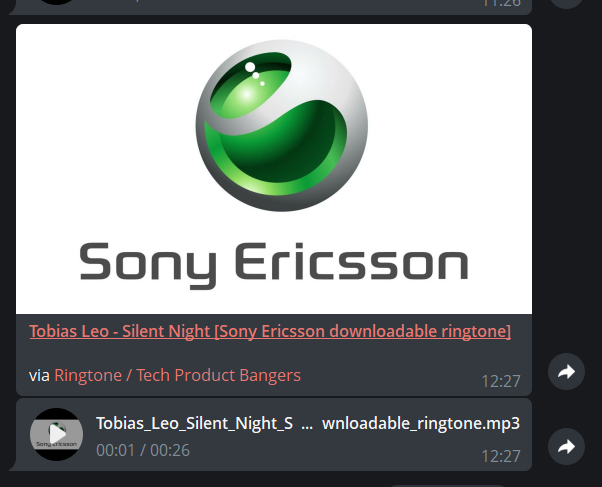
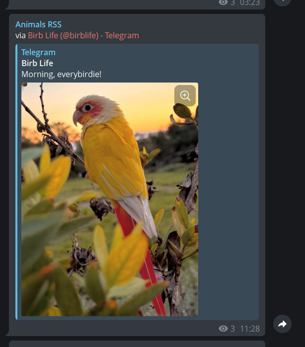
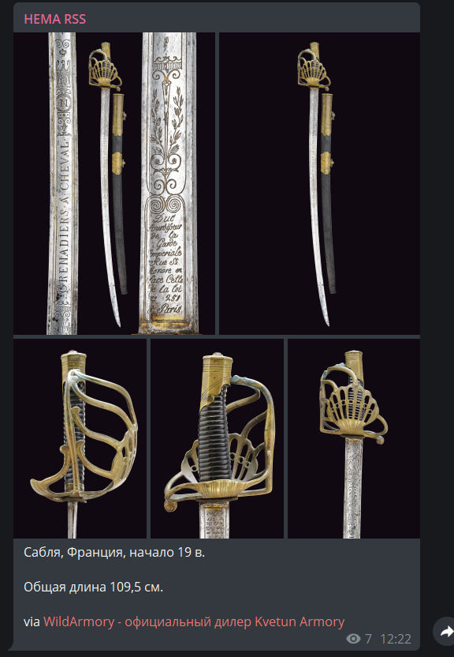
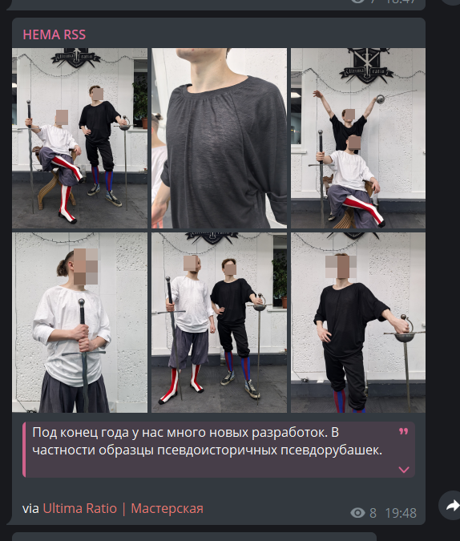

Bot that posts RSS feeds to Telegram. Made mostly for personal use, like an RSS-reader. 

`rss-to-telegram-engine` is designed to work with native RSS feeds and most [RSS generators](#suggestions). UX is a priority.

Real examples of `rss-to-telegram-engine` on Telegram:
- [@hema_feed](https://t.me/hema_feed) - HEMA and Fencing sports news (>40 feeds from youtube, reddit, telegram, vk)

See [Feed Examples](#feed-examples) to see screenshots of some specific examples.

## Table of Contents

- [Features](#features)
- [Run](#run)
- [Config](#config)
  - [Per-Feed Overrides (extra_flags)](#per-feed-overrides-extra_flags)
- [Commands](#commands)
- [Processors](#processors)
  - [media_extract](#media_extract)
  - [html_to_telegram](#html_to_telegram)
  - [jinja_formatter](#jinja_formatter)
  - [content_filter](#content_filter)
  - [ytdlp_downloader](#ytdlp_downloader)
  - [append_text](#append_text)
- [Suggestions](#suggestions)
- [Feed Examples](#feed-examples) (Reddit, Youtube, Youtube to mp3, Telegram, Vk)
- [Alternatives](#alternatives)

# Features

- Multi-channel with hierarchical and per-feed configuration
- Media extraction, with yt-dlp integration
- Templates 
- Filter by content 
- Robust HTML to Telegram markup conversion
- Config is human-readable json
- State is also json
- ...

# Usage
1. Create bot in [@BotFather](https://t.me/BotFather)
2. Create and fill out .env (in root directory)
3. Create and fill out config.json (in config directory)
4. Run
    - Using uv: `uv run python -m bot.main`
    - Using docker compose: `docker compose up -d --build`

# Config

All configuration files, state, templates, cookies, and proxy files should be placed in the `config/` directory.

<details>
<summary>Example .env</summary>

```
# Bot token from @BotFather
BOT_TOKEN=your_bot_token_here

# Comma-separated list of user IDs or channel IDs
ADMIN_IDS=123456789

# Logging level: DEBUG, INFO, WARNING, ERROR
LOG_LEVEL=INFO

# Path to main configuration file
CONFIG_PATH=config/config.json

# Path to state file
STATE_PATH=config/state.json

# Local Telegram Api (Optional, uncomment container in docker-compose.yml)
# Allows for larger uploads up to 2GB in size
# TELEGRAM_API_SERVER_URL="http://telegram-api-server:8081"
# TELEGRAM_API_ID="123..."
# TELEGRAM_API_HASH="12345..."
```

</details>

<details>
<summary>Example config.json</summary>

```json
{
    "_comment": "You can split configs into multiple files using 'includes'.",
    "includes": [],
    "global": {
        "check_interval": 300,
        "enable_preview": true,
        "processing": {
            "media_extract": {},
            "html_to_telegram": {},
            "jinja_formatter": {}
        }
    },
    "channels": [
        {
            "id": -1001234567890,
            "name": "tech news feed",
            "feeds": {
                "https://hnrss.org/newest": {
                    "note": "This feed will use title from RSS since name is null",
                    "processing": {
                        "media_extract": {},
                        "html_to_telegram": {},
                        "jinja_formatter": {
                            "show_author": true,
                            "show_title": true,
                            "show_content": true
                        }
                    }
                },
                "https://github.blog/feed/": {
                    "name": "GitHub Blog",
                    "note": "Custom name overrides RSS title.",
                    "check_interval": 600,
                    "processing": {
                        "media_extract": {
                            "download_media": true,
                            "max_media_size": 20971520,
                            "download_timeout": 30
                        },
                        "html_to_telegram": {},
                        "jinja_formatter": {
                            "show_author": false
                        }
                    }
                }
            }
        }
    ]
}
```

</details>

## Per-Feed Overrides (extra_flags)

You can override behavior of some processors for individual feeds using `extra_flags`. This is passed to all processors and allows per-feed customization without creating separate channel blocks.

```json
"feeds": {
    "https://example.com/feed": {
        "extra_flags": {
            "skip": true,
            "append_text": "#important @admin"
        }
    }
}
```

Supported flags:
- `skip` - Skip this feed entirely by `content_filter` processor
- `append_text` - Override text and/or position in `append_text` processor

# Commands
Only admins specified in .env can use commands.

- `/help` or `/status` - pull up Command list and Bot status
- `/list` - list out all live feeds
- `/test` - test feed url
- `/reload` - reload config after you edited the json files.

# Processors

Processors transform RSS entries before sending to Telegram. They run in the order specified in `processing` config. Each processor can be configured per-feed, per-channel, or globally.

Any processor pipeline should end with `html_to_telegram` and `jinja_formatter` processors to guarantee a successful telegram message.

## media_extract

Extracts media (images, videos, audio) from entry content and enclosures.

Options:
- `download_media` (bool, default: true) - Download media to buffers when True. Pass as urls when False (sometimes less robust)
- `max_media_size` (int, default: 20MB) - Maximum file size in bytes
- `download_timeout` (int, default: 30) - Download timeout in seconds
- `skip_if_has_media` (bool, default: false) - Skip if entry already has media (useful when run after yt-dlp processor)
- `remove_media_tags` (bool, default: true) - Remove media tags from content

```json
"media_extract": {
    "download_media": true,
    "max_media_size": 10485760
}
```

## html_to_telegram

Converts HTML content to Telegram-compatible HTML. Should run after `media_extract` but before `jinja_formatter`.

```json
"html_to_telegram": {}
```

## jinja_formatter

Formats the final message using Jinja2 templates. Should be the last processor (or before `append_text`).

All config options are passed to the template as context variables, so templates can define their own options.

Processor options:
- `template` (string, default: "default") - Template name (without .j2)
- `feed_name` - Custom feed name (overrides RSS title)
- `content_use_blockquote` (bool) - Wrap content in expandable blockquote
- `blockquote_length_threshold` (int, default: 750) - Min length to use blockquote
- `try_replace_content_with_title` (bool) - Fallback strategy when message too long

Default template (`config/jinja_templates/default.j2`) options:
- `show_title` (bool, default: true) - Show entry title
- `show_content` (bool, default: true) - Show entry content
- `show_author` (bool, default: false) - Show author name
- `title_bold` (bool, default: true) - Wrap title in `<b>` tags
- `title_underline` (bool, default: true) - Wrap title in `<u>` tags
- `title_as_link` (bool, default: true) - Make title a clickable link
- `plain_link` (bool, default: false) - Show raw URL instead of feed name link

```json
"jinja_formatter": {
    "show_author": true,
    "show_title": true,
    "show_content": false,
    "title_bold": true,
    "title_as_link": true
}
```

## content_filter

Filters posts based on regex pattern matching or media count.

Options:
- `skip_all` (bool, default: false) - Filter out all entries (temporarily disable a channel)
- `patterns` (list) - Regex patterns to match
- `match_title` (bool, default: true) - Check title
- `match_content` (bool, default: true) - Check content
- `match_mode` ("any" | "all", default: "any") - How patterns combine
- `invert` (bool, default: false) - If true, filter OUT non-matching posts
- `flags` (string) - Regex flags (e.g., "IGNORECASE,MULTILINE")
- `min_media_count` (int) - Minimum number of media attachments required
- `max_media_count` (int) - Maximum number of media attachments allowed

Extra flags support:
- `extra_flags.skip` (bool) - Skip individual feeds without creating separate channels

Filter out ads/sponsored posts:
```json
"content_filter": {
    "patterns": ["Advertisement", "Sponsored"],
    "match_mode": "any"
}
```

Keep only posts about Python:
```json
"content_filter": {
    "patterns": ["[Pp]ython"],
    "invert": true
}
```

Skip a specific feed:
```json
"feeds": {
    "https://example.com/noisy-feed": {
        "extra_flags": {"skip": true}
    }
}
```

## ytdlp_downloader

Downloads videos using yt-dlp. Requires yt-dlp to be installed (included in Docker image).

Options:
- `url_patterns` (list) - Regex patterns to match video URLs (default: YouTube, Reddit video)
- `search_in` (string, default: "link") - Where to search for URLs:
  - `"link"` - Only search in entry.link
  - `"title"` - Only search in entry.title
  - `"content"` - Search in entry.content (all matches)
  - `"content_first"` - Only first match in entry.content
  - `"all"` - Search everywhere
- `cookies_file` (string) - Path to cookies.txt file (e.g., `config/cookies.txt`)
- `proxy_file` (string) - Path to file containing proxy URL (e.g., `config/proxy.txt` with `socks5://host:port`)
- `max_filesize` (int, default: 50) - Max file size in MB
- `max_duration` (int, default: 900) - Max video duration in seconds
- `download_timeout` (int, default: 300) - Download timeout in seconds
- `quality` (string, default: "best[height<=720]/bv+ba/bv") - yt-dlp format selection
- `extract_audio` (bool, default: false) - Extract audio only (mp3 with thumbnail)
- `use_deno_js_runtime` (bool, default: false) - Use Deno JS runtime for YouTube
- `deno_path` (string, default: "/usr/local/bin/deno") - Path to Deno binary

```json
"ytdlp_downloader": {
    "url_patterns": ["https?://(?:www\\.)?youtube\\.com/watch"],
    "search_in": "link",
    "max_filesize": 50,
    "quality": "best[height<=720]"
}
```

## append_text

Appends custom text to formatted messages. Must run after `jinja_formatter`. Useful for adding #hashtags, @mentions, or other custom text to posts.

Options:
- `text` (string) - The text to append
- `position` (string, default: "suffix") - Where to place text: "prefix" or "suffix"

Extra flags support:
- `extra_flags.append_text` (string or dict) - Per-feed override. Can be a simple string or dict with `text` and `position`.

```json
"processing": {
    "jinja_formatter": {},
    "append_text": {
        "text": "#news"
    }
}
```

Per-feed override:
```json
"feeds": {
    "https://example.com/tech": {
        "extra_flags": {"append_text": "#tech"}
    },
    "https://example.com/sports": {
        "extra_flags": {"append_text": {"text": "#sports #news\n\n", "position": "prefix"}}
    }
}
```

# Suggestions:
- [RSS-Bridge/rss-bridge](https://github.com/RSS-Bridge/rss-bridge) — Create feeds from Youtube, Vk, Telegram channels and more.
- [trashhalo/reddit-rss](https://github.com/trashhalo/reddit-rss) — Media-rich reddit RSS. Doesn't require a reddit account. 

# Feed examples

Once you configured a feed you can use `/test` command to test it with the whole processing pipeline (`/test` command will try finding the url somewhere in config).

<details>
<summary>Reddit with media</summary>

You must self-host [trashhalo/reddit-rss](https://github.com/trashhalo/reddit-rss) to get videos and high resolution pirctures in RSS feed.

```json
{
    "id": -100123,
    "name": "vidya reddit",
    "enable_preview": false,
    "processing": {
        "ytdlp_downloader": {
            "search_in": "link",
            "max_duration": 200
        },
        "media_extract": {
            "skip_if_has_media": true
        },
        "html_to_telegram": {},
        "jinja_formatter": {
            "plain_link": false,
            "content_use_blockquote": true,
            "blockquote_only_if_exceeds": true
        }
    },
    "feeds": {
        "https://reddit-rss.example.com/r/shittydarksouls/top.json?sort=top&t=week": {
            "name": "reddit.com/r/shittydarksouls"
        }
    }
}
```


</details>

<details>
<summary>YouTube</summary>

I suggest self-hosting [RSS-Bridge/rss-bridge](https://github.com/RSS-Bridge/rss-bridge) but you can use the public instance.

Will download short videos, and just link the large ones. `show_content": false` to hide video description.

```json
{
    "id": -100123,
    "name": "vidya youtube",
    "processing": {
        "ytdlp_downloader": {
            "search_in": "link",
            "max_duration": 200
        },
        "html_to_telegram": {},
        "jinja_formatter": {
            "show_content": false
        }
    },
    "feeds": {
        "https://rss-bridge.org/?action=display&bridge=YouTubeFeedExpanderBridge&channel=UC2oWuUSd3t3t5O3Vxp4lgAA&format=Atom": {},
        "https://rss-bridge.org/?action=display&bridge=YouTubeFeedExpanderBridge&channel=UCDPG5a6rinyhES4wTLrGfig&format=Atom": {}
    }
}
```

<p float="left">
    
    
</p>

</details>

<details>
<summary>Music/Audio from YouTube</summary>

`"show_content": false` to hide video description. `cookies_file` and `proxy_file` are optional.

```json
{
    "id": -100123,
    "name": "Ringtone bangers",
    "processing": {
        "ytdlp_downloader": {
            "cookies_file": "config/cookies.txt",
            "proxy_file": "config/socks5.txt",
            "extract_audio": true,
            "search_in": "link",
            "max_duration": 2160
        },
        "media_extract": {
            "download_media": true,
            "max_media_size": 20971520,
            "download_timeout": 30
        },
        "html_to_telegram": {},
        "jinja_formatter": {
            "show_content": false
        }
    },
    "feeds": {
        "https://rss-bridge.org/bridge01/?action=display&bridge=YouTubeFeedExpanderBridge&channel=UCjEk4ipFLqcdZ_m7uqItTIw&format=Atom": {}
    }
}
```


</details>

<details>
<summary>Telegram</summary>

Telegram natively embeds all media nicely, skip everything other than link.

```json
{
    "id": 123,
    "name": "animals telegram",
    "processing": {
        "html_to_telegram": {},
        "jinja_formatter": {
            "show_title": false,
            "show_content": false
        }
    },
    "feeds": {
        "https://rss-bridge.org/?action=display&bridge=TelegramBridge&username=@birblife&format=Atom": {}
    }
}
```


</details>

<details>
<summary>VKontakte</summary>

You must self-host [RSS-Bridge/rss-bridge](https://github.com/RSS-Bridge/rss-bridge) and use Vk api by using your Vk.com account and creating a Vk app. See [rss-bridge docs](https://rss-bridge.github.io/rss-bridge/Bridge_Specific/Vk2.html).

```json
{
    "id": -100123,
    "name": "hema news vk",
    "processing": {
        "media_extract": {},
        "html_to_telegram": {},
        "jinja_formatter": {
            "show_title": false,
            "try_replace_content_with_title": true,
            "content_use_blockquote": true,
            "blockquote_only_if_exceeds": true
        }
    },
    "feeds": {
        "https://rss.example.com/?action=display&bridge=Vk2Bridge&u=wildarmory&format=Atom": {},
        "https://rss.example.com/?action=display&bridge=Vk2Bridge&u=ur_for_hema&format=Atom": {}
    }
}
```

Using `"content_use_blockquote": true` will hide long text in exandable block.
Text exceeding telegram limit of 4096 will be excluded entirely.

<p float="left">
    
    
</p>

</details>

# Alternatives
- [Rongronggg9/RSS-to-Telegram-Bot](https://github.com/Rongronggg9/RSS-to-Telegram-Bot) — Better multi-user support
